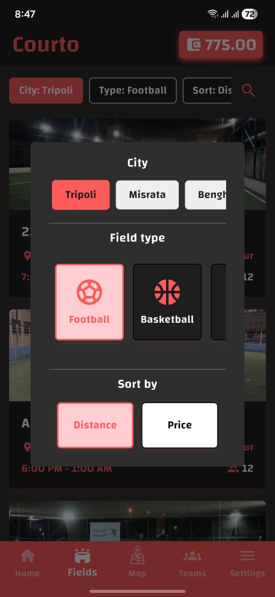
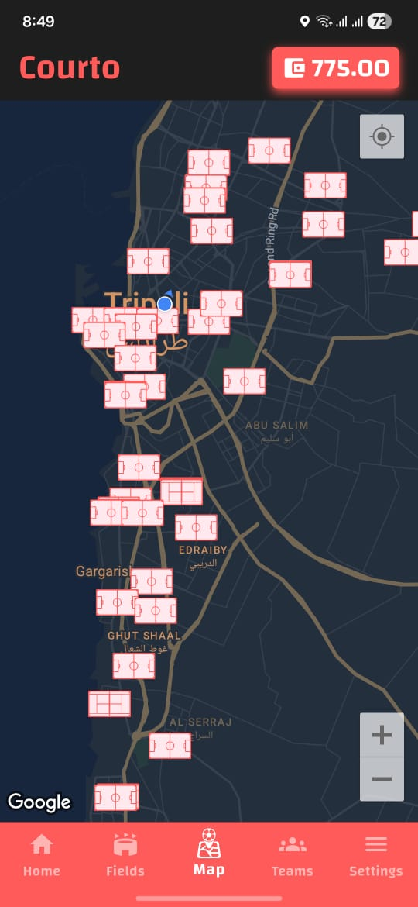
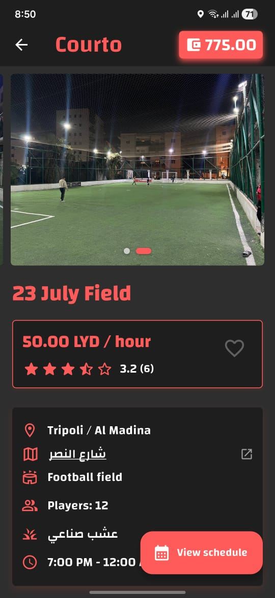

<div align="center">


### _Book the field. Assemble the squad. Get in the game._

[](https://flutter.dev)
[](#)
[](#)
[](#)

</div>


**Courto** is a mobile app for booking football, basketball, tennis, and padel fields, think of it as your matchmaking lobby for real-life sports. Find a court, lock in a slot, invite your squad, and show up. No spreadsheets, no group-chat chaos, no guy who "forgot" to pay.

Built with Flutter for a native feel on both Android and iOS, fully bilingual (Arabic / English), and designed around how people actually book courts: fast, social, and mobile-first.

---

## Achievements Unlocked

| | |
|---|---|
|  **Auto-Locate** | Detects your city and shows nearby fields before you even search |
|  **Daily & Monthly Booking** | Reserve a single slot or lock in a recurring monthly spot |
|  **Live Slot Calendar** | Real-time availability so you never book a field that's already taken |
|  **Matchmaking** | Create a match, invite players, and build your team roster |
|  **In-App Wallet & Payments** | Top up your wallet and pay for bookings securely via card |
|  **Subscriptions & Plans** | Recurring subscription plans for regulars |
|  **Slot Discounts** | Special pricing on selected time slots |
|  **Favorites** | Pin your go-to fields for one-tap rebooking |
|  **Push Notifications** | Never miss a booking reminder or match update |
|  **Light & Dark Mode** | Play your way, day or night |
|  **Arabic & English** | Fully localized experience, RTL included |
|  **Interactive Field Maps** | Browse fields on a live map with location links |

---

## Screenshots

<div align="center">

| Field Discovery | Fields Map | Matchmaking |
|:---:|:---:|:---:|
|  |  |  |

</div>


## The Loadout (Tech Stack)

- **Framework:** Flutter 3.8+ / Dart
- **State Management:** Provider
- **Maps:** Google Maps Flutter + Flutter Map
- **Payments:** Moamalat Payment Gateway
- **Push Notifications:** OneSignal
- **Location:** Geolocator
- **Local Storage:** Shared Preferences
- **Localization:** Flutter Intl (Arabic / English)

---

##  Quest Log: Getting Started

### Prerequisites
- Flutter SDK `^3.8.1`
- Android Studio / Xcode for platform builds

### 1. Clone the repo
```bash
git clone https://github.com/DeadMoza/courto.git
cd courto
```

### 2. Install dependencies
```bash
flutter pub get
```

### 3. Configure your environment
Copy the example env file and fill in your own credentials:
```bash
cp .env.example .env
```

You'll need your own keys for:
- Backend API (`API_URL`, `API_KEY`)
- OneSignal (`ONESIGNAL_APP_ID`)
- Moamalat payment gateway (`MOAMALAT_*`)
- Rasael SMS/OTP provider (`RASAEL_*`)

### 4. Add your Maps API key
- **Android:** add `mapsApiKey=YOUR_KEY` to `android/key.properties`
- **iOS:** add `MAPS_API_KEY=YOUR_KEY` to `ios/Flutter/Secrets.xcconfig`

### 5. Run it
```bash
flutter run
```

<div align="center">

Made by Ahmed Elshami

</div>
